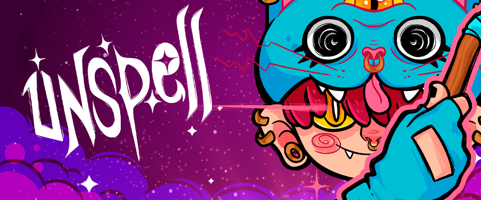
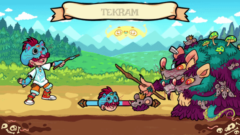

# Unspell



A word-dueling game built in 9 days for **LÖVE Jam 2026**.

🔗 Play it: [mutantcapybara.itch.io/unspell](https://mutantcapybara.itch.io/unspell)

## About

Unspell is a word-dueling game where a word appears at the top of the screen with its letters reversed (last letter first). Type it correctly, fast, before your life runs out. Built from scratch for LÖVE Jam 2026 using the LÖVE2D framework.

<p align="center">  </p>

- Programming (game logic, state management)
- Sound design and SFX implementation

## Tech Stack

- **Engine:** LÖVE2D (LÖVE 11.x)
- **Language:** Lua
- **Libraries:** [push](https://github.com/Ulydev/push) for resolution scaling and fullscreen handling

## Architecture

The game runs on a simple state machine (`States/`), with each screen — splash, menu, tutorial, game, and credits — as an isolated module with its own `enter`, `update`, `draw`, `keypressed`, and `exit` hooks. `main.lua` just routes `love.update`/`love.draw`/input callbacks to whatever state is currently active via `changeState()`.

Resolution is handled with `push`, rendering at a fixed internal resolution of 1920x1080 and scaling to whatever window size the player has, without distorting the UI or gameplay.

## Project Structure

```
unspell-jam/
├── States/       # menu, game, splash, credits, tutorial — one file per screen
├── Assets/       # sprites, images
├── Fonts/        # custom fonts
├── Shaders/      # visual effects
├── Libraries/    # push (resolution scaling)
├── conf.lua      # LÖVE window/config setup
└── main.lua      # entry point, state routing
```

## Running Locally

1. Install [LÖVE](https://love2d.org/) (11.x or compatible).
2. Clone this repo.
3. Run:
   ```
   love .
   ```
   (or drag the project folder onto the LÖVE executable)

## Credits

Made for LÖVE Jam 2026 by [Julio Rocha](https://github.com/ojuliocr).